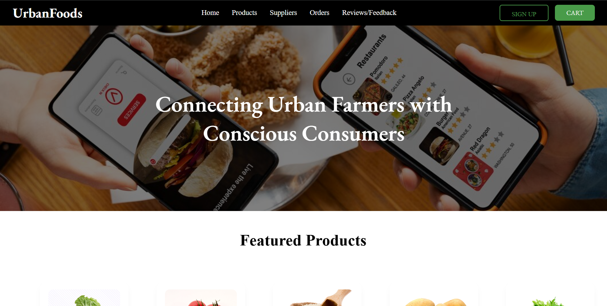
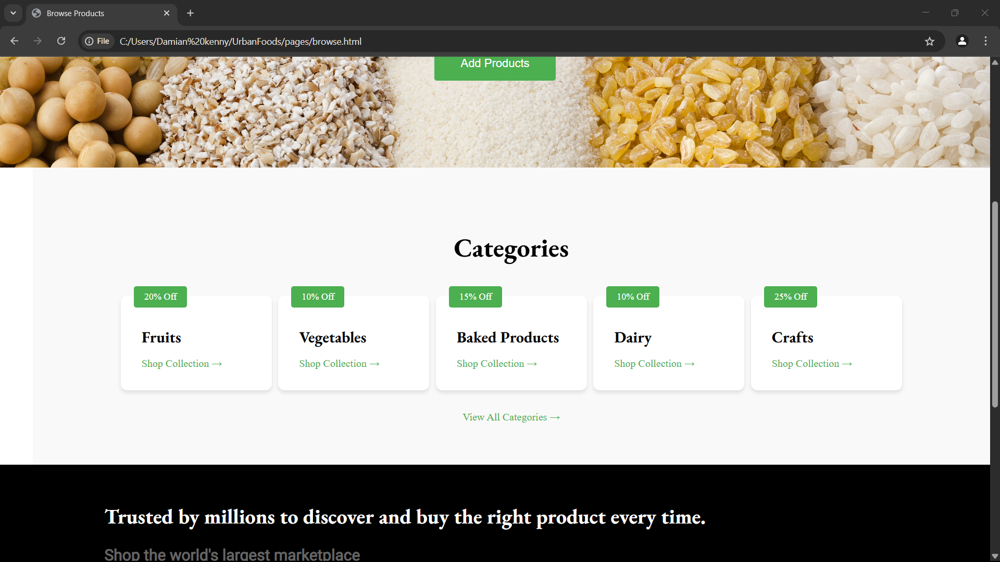
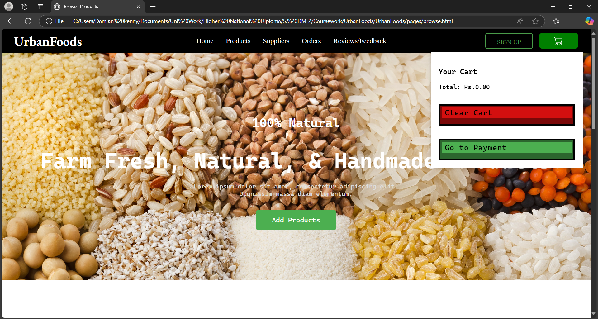

# UrbanFoods - Food Delivery System

UrbanFoods is a food delivery system where users can browse and purchase products, organized into categories.  
This project demonstrates the integration of **Oracle Database (SQL + PL/SQL)** and **MongoDB (NoSQL)** to manage structured business data alongside user-generated content like reviews and feedback.

## Key Features

- Browse and filter products by categories and price
- Place and manage orders with a cart system
- Track order statuses in real-time
- Add and view product reviews and customer feedback
- Integrated backend using Oracle DB and MongoDB

## Project Steps

### Step 2: Implement Oracle Database Schema

1. Create tables in Oracle using SQL DDL commands (`CREATE TABLE`).
2. Add constraints (primary keys, foreign keys, NOT NULL).
3. Develop PL/SQL stored procedures for:
   - Calculating total sales for a period.
   - Identifying high-demand products.
   - Updating order/delivery statuses.

**Tools:** Oracle SQL Developer or APEX  
**Outcome:** Functional Oracle schema with tables and PL/SQL code for key operations.

### Step 3: Populate Data & Test PL/SQL Queries

1. Write SQL scripts to insert realistic sample data (10 suppliers, 50 products, 100 orders).
2. Test PL/SQL procedures (e.g., run `total_sales('2025-03-01', '2025-03-31')`).
3. Validate queries (ensure high-demand products return accurate results).

**Outcome:** A populated database with working PL/SQL operations.

### Step 4: Front-End Application Development

1. Choose a framework (React for web, Spring Boot for enterprise).
2. Develop UI for:
   - Product browsing (filter by category, price).
   - Order placement (cart system).
   - Order tracking (status updates from Oracle).
3. Connect UI to Oracle using drivers (JDBC, Hibernate).

**Outcome:** Functional application that interacts with the Oracle backend.

### Step 5: Integrate MongoDB (NoSQL)

1. Design MongoDB collections for:
   - Product Reviews (product ID, user ID, rating, comment).
   - Customer Feedback (user ID, feedback text, date).
2. Write code to:
   - Insert reviews/feedback into MongoDB.
   - Display reviews alongside product details (fetch from Oracle + MongoDB).
3. Use MongoDB drivers (PyMongo, Mongoose) in your application.

**Outcome:** User-generated content stored in MongoDB and displayed in the UI.

## Project Screenshots

You can include screenshots of your project here to showcase the UI and features:

- **Home Page**  
  

- **Product Browsing**  
  

- **Cart**
  
